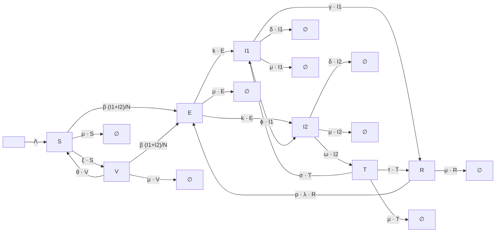

# TB_Ayinla_2021 Model

## Overview  

This model is adapted from **Ayinla et al. (2021)**, who divide the total population \(N\) into seven mutually exclusive classes:

- **S**: Susceptible individuals  
- **V**: Vaccinated individuals  
- **E**: Latently infected individuals (unaware of their condition)  
- **I1**: Undiagnosed infectious individuals  
- **I2**: Diagnosed infectious individuals  
- **T**: Treated individuals  
- **R**: Recovered individuals  

---

## Biological Interpretation

- **Susceptible (S)** individuals are those at risk of acquiring TB infection.  
- **Vaccinated (V)** individuals have received a vaccine, which reduces their risk of infection but may wane over time (waning immunity, parameter \(\theta\)).  
- **Latently infected (E)** individuals harbor the TB pathogen without showing clinical symptoms. They are unaware of their condition until diagnosed, often by a **tuberculin skin test**.  
  - Latency can be **fast** (1–5 years) or **slow** (several years).  
- **Undiagnosed infectious (I1)** are actively infectious but not yet diagnosed.  
- **Diagnosed infectious (I2)** are identified as TB cases and may transition to treatment.  
- **Treated individuals (T)** undergo therapy, but reinfection is possible (\(\sigma\)).  
- **Recovered (R)** individuals regain health, but may not acquire permanent immunity and can be reinfected (\(p\)).  

---

## Model Assumptions

- The population is **dynamic**, with recruitment (\(\Lambda\)) and natural death (\(\mu\)).  
- Vaccination occurs at rate \(\xi\), and vaccine efficacy (\(\omega\)) reduces susceptibility.  
- Vaccination protection wanes at rate \(\theta\).  
- Transmission occurs via **force of infection**:

\[
\lambda = \frac{\beta c (I_1 + I_2)}{N}
\]

- Latently infected individuals may progress to active TB (\(E \to I_1\) or \(E \to I_2\)) at rate \(k\).  
- Treated individuals can experience **reinfection** (\(\sigma\)) or recover fully (\(\tau\)).  
- Exogenous reinfection occurs at rate \(p\).  
- TB-induced deaths occur in infectious compartments at rate \(\delta\).  

---

## Compartmental Diagram




---

## TB_Ayinla_2021 Model Configuration

Below is an example configuration for the **TB_Ayinla_2021 model** in YAML format.

```yaml
timescale: 50
time_unit: years
noise_std: 5.0
subset_ratio: 0.7
optimizers: [Nelder-Mead, BFGS, L-BFGS-B]
TB_ayinla_2021_model:   
  compartments: [S, V, E, I1, I2, T, R]
  parameters: {Lambda: 5, mu: 0.15, beta: variable, theta: [0.067, 0.1], xi: [0.0, 0.1, 0.98, 0.95], omega: [0.0, 1.0], k: 0.02, tau: [1.5, 3.5], delta: 0.12, sigma: [0.0, 1.0], p: [0.0, 1.0]}
  transitions: {"-> S": "Lambda", "S -> V": "xi * S", "V -> S": "theta * V", "S -> E": "(1 - omega) * Lambda * S", "V -> E": "(1 - omega) * Lambda * V", "E -> I": "k * E + p * Lambda * E", "I -> R": "tau * I", "I ->": "delta * I", "T -> I": "sigma * T", "T -> R": "tau * T", "S ->": "mu * S", "V ->": "mu * V", "E ->": "mu * E", "I ->": "mu * I", "T ->": "mu * T", "R ->": "mu * R"}
  population: 1000
  initial_conditions: {S: 990, V: 0, E: 5, I: 5, T: 0, R: 0}
  force_of_infection: "lambda = beta * I / N"
  assumptions: The model includes vaccination, waning immunity, reinfection among treated individuals, and exogenous re-infection. The population is dynamic, with recruitment (Λ) and natural death (μ). Vaccine efficacy reduces infection risk by factor (ω). Recovery does not always confer full immunity due to reinfection processes.
```