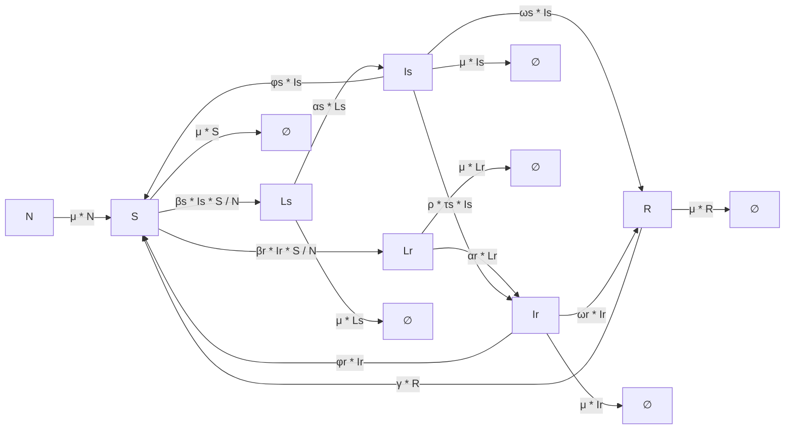

# TB Model

## Overview  

Kuddus et al. (2022) proposed a **two-strain tuberculosis (TB) model** to study **drug-susceptible (DS)** and **drug-resistant (DR)** TB dynamics in Bangladesh.  

In this model, the total population `N` is divided into **six mutually exclusive compartments**:  

- `S`: Susceptible  
- `Ls`: Latently infected with drug-susceptible TB  
- `Is`: Infectious with drug-susceptible TB  
- `Lr`: Latently infected with drug-resistant TB  
- `Ir`: Infectious with drug-resistant TB  
- `R`: Recovered  

---
## Transition Diagram



---

## TB Model Configuration

Below is an example configuration for the **TB model** in YAML format.

```yaml
TB_model:  
  compartments: [S, Ls, Is, Lr, Ir, R]
  parameters: {mu: 0.0142857, beta_s: 1.57e-8, beta_r: 6.25e-9, alpha_s: 0.129, alpha_r: 0.129, omega_s: 0.287, omega_r: 0.12, rho: 0.07, phi_s: 0.37, phi_r: 0.37, tau_s: 0.94, tau_r: 0.78, gamma: 0.1 }
  transitions: {"R -> S": "gamma * R", "Is -> S": "phi_s * Is", "Ir -> S": "phi_r * Ir", "S -> Ls": "beta_s * Is * S / N", "S -> Lr": "beta_r * Ir * S / N","S ->": "mu * S", "-> S": "mu * N", "Ls -> Is": "alpha_s * Ls", "Ls ->": "mu * Ls", "Is -> R": "omega_s * Is", "Is -> R_extra": "(1 - rho) * tau_s * Is" , "Is ->": "mu * Is", "Is -> Ir": "rho * tau_s * Is", "Lr -> Ir": "alpha_r * Lr", "Lr ->": "mu * Lr", "Ir -> R": "omega_r * Ir", "Ir -> R_extra": "tau_r * Ir", "Ir ->": "mu * Ir", "Ir -> S": "phi_r * Ir", "R ->": "mu * R"}
  population: 100000
  initial_conditions: {Ls: 400, Is: 300, Lr: 10, Ir: 400, R: 5, S: 98885}
  assumptions: TB transmission with drug-sensitive (DS) and drug-resistant (DR) strains, based on Kuddus (2022).
  plot_settings:
    scale_by_population: true   
    per_unit: 100000        
    time_unit: years
```