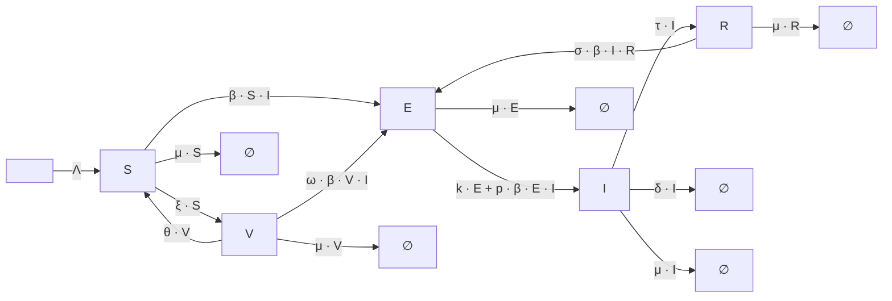

# TB_Sulayman_2021 Model

## Overview  

This model is adapted from **Sulayman et al. (2021)**, who divide the total population \(N\) into five mutually exclusive classes:

- **S**: Susceptible individuals  
- **V**: Vaccinated individuals  
- **E**: Exposed (latently infected, not yet infectious) Individuals
- **I**: Infectious individuals 
- **R**: Recovered individuals  

---

## Biological Interpretation

- **Susceptible (S)** individuals are those at risk of acquiring TB infection.  
- **Vaccinated (V)** individuals have received a vaccine, which reduces their risk of infection but may wane over time (waning immunity, parameter \(\theta\)).  
- **Latently infected (E)** individuals harbor the TB pathogen without showing clinical symptoms. They are unaware of their condition until diagnosed, often by a **tuberculin skin test**.  
  - Latency can be **fast** (1–5 years) or **slow** (several years).  
- **Undiagnosed infectious (I1)** are actively infectious but not yet diagnosed.  
- **Diagnosed infectious (I2)** are identified as TB cases and may transition to treatment.  
- **Treated individuals (T)** undergo therapy, but reinfection is possible (\(\sigma\)).  
- **Recovered (R)** individuals regain health, but may not acquire permanent immunity and can be reinfected (\(p\)).  

---

## Model Assumptions

- The population is **dynamic**, with recruitment (\(\Lambda\)) and natural death (\(\mu\)).  
- Vaccination occurs at rate \(\xi\), and vaccine efficacy (\(\omega\)) reduces susceptibility.  
- Vaccination protection wanes at rate \(\theta\).  
- Transmission occurs via **force of infection**:

\[
\lambda = \frac{\beta c (I_1 + I_2)}{N}
\]

- Latently infected individuals may progress to active TB (\(E \to I_1\) or \(E \to I_2\)) at rate \(k\).  
- Treated individuals can experience **reinfection** (\(\sigma\)) or recover fully (\(\tau\)).  
- Exogenous reinfection occurs at rate \(p\).  
- TB-induced deaths occur in infectious compartments at rate \(\delta\).  

---

## Compartmental Diagram




---

## TB_Sulayman_2021 Model Configuration

Below is an example configuration for the **TB_Sulayman_2021 model** in YAML format.

```yaml
TB_sulayman_2021_model:   
  compartments: [S, V, E, I, R]
  parameters: {Lambda: 5, mu: 0.15, beta: 0.25, theta: 0.069, xi: 0.5, omega: 0.5, k: 0.02, tau: 2.5, delta: 0.12, sigma: 0.5, p: 0.5}
  transitions: {"-> S": "Lambda", "S -> V": "xi * S", "V -> S": "theta * V", "S -> E": "beta * S * I", "V -> E": "omega * betaa * V * I", "E -> I": "k * E + p * beta * E * I", "I -> R": "tau * I", "I ->": "(mu + delta) * I", "S ->": "mu * S", "V ->": "mu * V", "E ->": "mu * E", "I ->": "mu * I", "R ->": "mu * R", "R -> E": "sigma * beta * I * R"}
  population: 100000
  assumptions: |
    Sulayman et al. (2021) propose an SVEIRE TB model incorporating:
      - Vaccination (V) with waning immunity (θ) and imperfect efficacy (ω)
      - Exogenous reinfection (p) and reinfection among recovered (σ)
      - Natural mortality (μ) and TB-induced mortality (δ)
      - Recruitment inflow (Λ)
      - Disease progression from exposed (E) to infected (I) via rate (k)
      - Recovery of infected individuals at rate (τ)
  simulation_time: 50
  time_unit: years
  plot_settings:
    y_scale: linear
    scale_by_population: true   
    per_unit: 100000
  calibration_settings:
    target_data: TB_data.csv # or file_name.csv for real data  
    noise_std: 5.0
    subset_ratio: 0.7
    optimizers: [Nelder-Mead, BFGS, L-BFGS-B]
    update_config: false
```