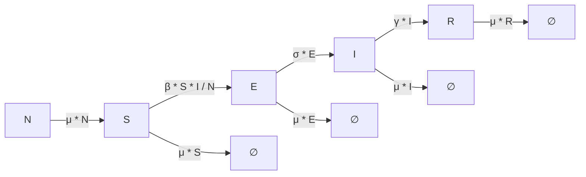

# SEIR Model

The **SEIR model** is one of the simplest compartmental models in epidemiology.  
It divides the population into four compartments:  

- **S (Susceptible):** Individuals who are healthy but can contract the disease.  
- **E (Exposed):** Individuals who have been infected but are not yet infectious (in the incubation period).
- **I (Infected):** Individuals currently infected and able to spread the disease.  
- **R (Recovered):** Individuals who have recovered and gained immunity. 

---

## Transition Diagram



---

## SEIR Model Configuration

Below is an example configuration for the **SEIR model** in YAML format.

```yaml
SIR_model:
  compartments: [S, E, I, R]
  parameters: {beta: 0.3, sigma: 0.1, gamma: 0.1, mu: 0.01}
  transitions: {"S -> E": "beta * S * I / N", "E -> I": "sigma * E", "I -> R": "gamma * I", "-> S": "mu * N", "S ->": "mu * S", "E ->": "mu * E", "I ->": "mu * I", "R ->": "mu * R"}
  population: 1000
  initial_conditions: {S: 990, E: 0, I: 10, R: 0}
  assumptions: The population is closed (no births or deaths). The disease has an exposed stage before becoming infectious. Immunity is permanent after recovery.
```


 