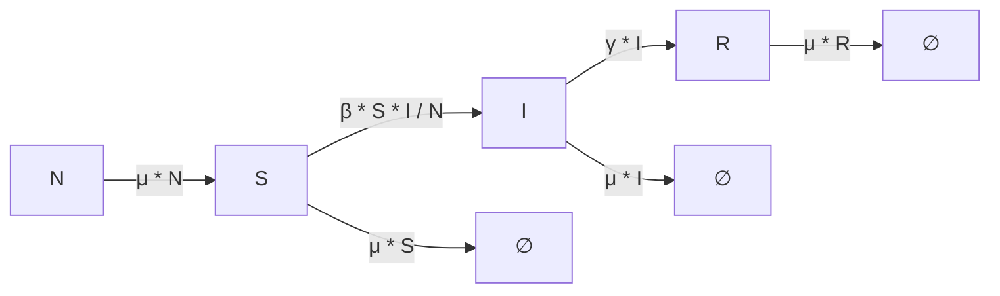

# SIR Model

The **SIR model** is one of the simplest compartmental models in epidemiology.  
It divides the population into three compartments:  

- **S (Susceptible):** Individuals who are healthy but can contract the disease.  
- **I (Infected):** Individuals currently infected and able to spread the disease.  
- **R (Recovered):** Individuals who have recovered and gained immunity. 

---

## Transition Diagram



---

## SIR Model Configuration

Below is an example configuration for the **SIR model** in YAML format.

```yaml
timescale: 15
time_unit: days
noise_std: 5.0
subset_ratio: 0.7
optimizers: [Nelder-Mead, BFGS, L-BFGS-B]
SIR_model:
  compartments: [S, I, R]
  parameters: {beta: 0.25, gamma: 0.15, mu: 0.015}
  transitions: {"S -> I": "beta * S * I / N", "I -> R": "gamma * I", "-> S": "mu * N", "S ->": "mu * S", "I ->": "mu * I", "R ->": "mu * R"}
  population: 1000
  initial_conditions: {S: 990, I: 10, R: 0}
  assumptions: The population is closed (no births or deaths). The disease is transmitted through direct contact. Immunity is permanent after recovery.
```