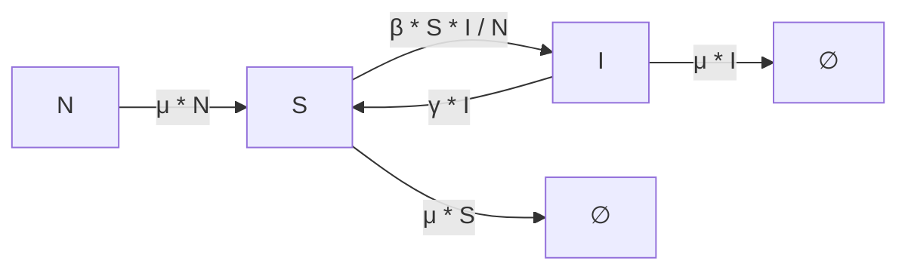

# SIS Model

The **SIS model** is one of the simplest compartmental models in epidemiology.  
It divides the population into two compartments:  

- **S (Susceptible):** Individuals who are healthy but can contract the disease.  
- **I (Infected):** Individuals currently infected and able to spread the disease.  

---

## Transition Diagram



---

## SIS Model Configuration

Below is an example configuration for the **SIS model** in YAML format.

```yaml
SIS_model:
  compartments: [S, I]
  parameters: {beta: 0.3, gamma: 0.1, mu: 0.01}
  transitions: {"S -> I": "beta * S * I / N", "I -> S": "gamma * I", "-> S": "mu * N", "S ->": "mu * S", "I ->": "mu * I"}
  population: 1000
  initial_conditions: {S: 990, I: 10}
  assumptions: The population is closed (no births or deaths). The disease does not confer permanent immunity. After recovery, individuals return to the susceptible class (no immunity).
```